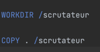
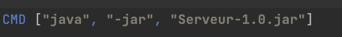

# Dockerisation d'un composant de la SAE
### Fait par Alfonso Jimenez et Hamza Azzin

## Contexte 
Dans le contexte de notre SAE, moi et un groupe de personnes
nous devions créer una application qui permette du vote sécurisée et 
à longue distance. 

Notre projet possède plusieurs applications qui communiquent entre
elles pour atteindre leur objectif que c'est de permettre à 
l'utilisateur de voter. 

## Notre choix 
On a choisit de dockeriser l'application scrutateur de 
notre projet. On a pris cette décision simplement puisque l'interface
qui apparait une fois que le Scrutateur est initialisé est aggréable a voir. 

### Mais comment on fait pour dockeriser une application ? 

Après plusieurs essais de dockeriser d'application quelconques. 
On s'est rendu compte que les elements essentielles pour rendre
possible la dockerisation de notre programme JAVA étaient le fichier 
Dockerfile et le compose.ylm. 
Cependant après plus de recherche et lecture de la documentation 
de Docker. On s'est rendu compte que c'était même pas nécessaire 
d'utiliser un compose.ylm pour dockeriser notre application. 

Ce fut ainsi qu'on planifia des instructions à suivre pour dockeriser
l'application : 

### Generation du .jar

La manière la plus simple et rapide d'executer notre application 
était de créer un document .jar. 
Heureusement pour nous, on a utilisé l'architecture graddle pour 
coder notre projet.
Cette architecture permet de générer un document .jar en faisant 
pas plus de 5 clicks. 

### Création du DockerFile 
Pour créer une image docker et pouvoir exécuter notre
programme, il fallait utiliser un Dockerfile. 
Dans ce DockerFile on introduit une librairie qui permet d'executer 
du code JAVA. 

On choisir notre directeur principal
Et copie toutes les données du fichier dans le même 

Finalement on émule l'utilisation du terminal. 
Pour executer la commande 

<code>java -jar notre.jar </code>

### Creation et execution d'une image docker

Pour créer l'image il a juste fallu exécuter une commande
dans le terminal dans le dossier contenant le Dockerfile

<code> docker build -t leNomDeVotreImage . </code>

A noter qu'on ne peut pas creer des images dont le nom est avec majuscules

Le point qui suit le nom de l'image veut dire qu'on va generer notre
image dans le fichier courant. 

Une fois cette commande exécutée. Il nous faut juste exécuter 
l'image docker déjà configuré ayant openjdk installé. 

<code> docker run leNomDeVotreImage </code>

### Migration Git

On a ensuite crée un repo git, cloné ce repo et mis les 
fichier DockerFile plus notre .jar dedans. 

